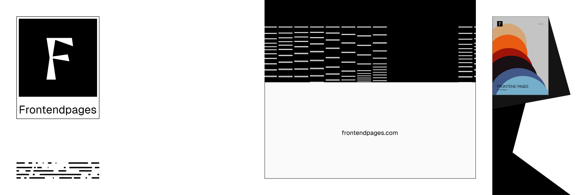

<div align="center">
  <h1>Frontend Pages</h1>
  <p>The readable web platform documentation.</p>
</div>

<p align="center">
  
</p>

## About

Learn the web platform from first principles — core technologies and frameworks, weird CSS, and advanced rendering with WebGL/WebGPU.

> Note: this project is under active development.

## Tech

- Next.js (apps/web)
- Fumadocs (MDX + UI)
- Turborepo + pnpm workspaces

## Getting started

### Requirements

- Node.js `>=22`
- pnpm

### Install

```bash
pnpm install
```

### Run the web app

```bash
pnpm web:dev
```

## License

MIT
